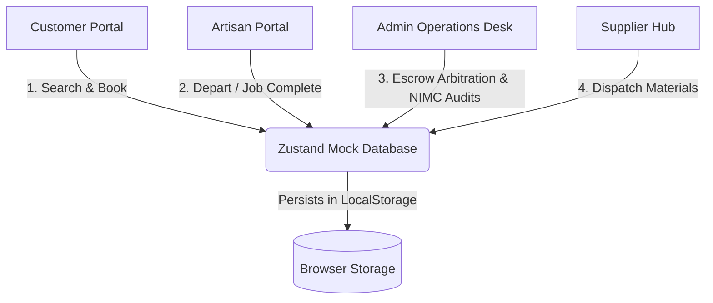

# NexPlumb — Trust-First Artisan Marketplace for Lagos

NexPlumb is a modern, premium two-sided marketplace connecting homeowners and vetted artisans in Lagos with escrow security, government identity checks, and automated Service Level Agreements (SLAs).

The platform is designed to be **confident, professional, and warm**, prioritizing substance and security. It is optimized to perform under low-bandwidth connections (3G) while maintaining a seamless user experience.

---

## 📖 Table of Contents

1. [System Architecture & Portals](#-system-architecture--portals)
2. [Key Workflows & Simulations](#-key-workflows--simulations)
3. [Technology Stack](#-technology-stack)
4. [Design System & UI Specs](#-design-system--ui-specs)
5. [Directory Structure](#-directory-structure)
6. [Getting Started & Installation](#-getting-started--installation)
7. [Compliance & Privacy (NDPA)](#-compliance--privacy-ndpa)

---

## 🏛️ System Architecture & Portals

The application features a shared-state architecture managed on the client side via a local-storage synchronized database. This enables multi-role simulation across the following portals:



### 1. 👤 Customer Portal
*   **Artisan Directory & Advanced Search (`/search`)**: Interactive grid filterable by Local Government Areas (LGAs), ratings, and trades. Features an interactive SVG-based map of Lagos LGAs.
*   **Vetted Profiles (`/artisans/[slug]`)**: Spotlights rating distributions, portfolio lightboxes, verification badges, and real homeowner testimonials.
*   **Escrow Booking Checkout (`/book/[slug]`)**: Step-by-step booking form capturing requirements, address, and files, followed by a secure, simulated Paystack payment gateway.
*   **Live Tracker Map (`/jobs/[id]/track`)**: Real-time status update timeline (Confirmed → En Route → On Site → In Progress → Completed) with simulated GPS artisan location movements.

### 2. 🛠️ Artisan Control Center
*   **Onboarding Wizard (`/join-as-artisan`)**: Multi-step registration capturing profile details, trade certifications, bank payout structures, and NIMC NIN/BVN lookups.
*   **Dashboard (`/artisan/dashboard`)**: Online/Offline status switch, real-time incoming job dispatch alerts, job accepting/counter-proposal engine, and active job lists.
*   **Earnings Ledger (`/artisan/earnings`)**: Deep accounting overview including pending escrow balances, available balances, trends, and payout history.
*   **Reviews Moderation (`/artisan/reviews`)**: Inline replies to client comments, rating breakdowns, and dispute escalation triggers.
*   **Microcredit Finance (`/artisan/finance`)**: Lease-to-own equipment calculator allowing artisans to request upgrades funded directly from earnings.

### 3. 🛡️ Admin Operations Command Desk
*   **System Overview (`/admin/dashboard`)**: Real-time dispatch list, SLA violation flags, and total platform Gross Merchandise Value (GMV).
*   **Jobs Registry (`/admin/jobs`)**: Detail drawer audit module with downloadable data sheets under strict access logs.
*   **Verification Pipeline (`/admin/verification`)**: Dual-pane comparison of profile pictures against NIMC data alongside Corporate Affairs Commission (CAC) lookups.
*   **Dispute Arbitration (`/admin/disputes`)**: Settlement panel featuring evidence side-by-sides, split-settlement sliders, and compliance justification.
*   **Analytics Matrix (`/admin/analytics`)**: Custom SVG interactive charts tracking revenue growth, conversion paths, and LGA market shares.

### 4. 📦 Merchant & Partner Scaffolds
*   **Supplier Hub (`/supplier/*`)**: Wholesale supplier dashboard featuring warehouse inventory catalogs, low-stock warnings, and order dispatch status logs.
*   **Enterprise Facilities (`/enterprise`)**: Showcase portal for corporate property managers outlining custom SLA policies and bulk invoicing workflows.

---

## 🔄 Key Workflows & Simulations

The application operates on a unified mockup database (`nexplumb-db-storage`) in `LocalStorage`. To run a full end-to-end dispatch and escrow lifecycle test:

1.  **Search & Book**: Go to the Customer portal (`/search`), find an artisan (e.g., `Chukwuemeka Okonkwo`), and initiate booking for **₦13,500**.
2.  **Lock Escrow**: Complete the booking checkout steps. This triggers the simulated Paystack dialog, debiting the customer wallet and locking funds in the system Escrow.
3.  **Accept Dispatch**: Go to the Artisan Dashboard (`/artisan/dashboard`), toggle your status to **Online**, and accept the new job notification alert.
4.  **Track Artisan**: Open the Customer's Tracker (`/jobs/[id]/track`) to view live GPS updates as the artisan moves from *En Route* to *On Site*.
5.  **Submit Work**: In the Artisan portal (`/artisan/dashboard`), select the active job, submit completion evidence (photos), and request payout.
6.  **Resolve / Arbitrate**:
    *   *Path A (Happy Path)*: The Customer reviews the work, clicks **Release Escrow**, and funds (minus the 12% commission) transfer to the artisan's available balance.
    *   *Path B (Dispute)*: The Customer files a dispute. Open `/admin/disputes` as an admin, review the arguments, set a refund split (e.g., 60% customer, 40% artisan), and commit. The wallets update immediately.

---

## 💻 Technology Stack

*   **Framework**: Next.js 15 (App Router) & React 19
*   **State Management**: Zustand (with state persistence middleware)
*   **Styling**: Tailwind CSS
*   **Form Validation**: React Hook Form with Zod resolvers
*   **Icons**: Lucide React
*   **Charts**: Recharts & Custom Responsive SVGs
*   **HTTP Client**: Axios

---

## 🎨 Design System & UI Specs

All layouts strictly adhere to the [NexPlumb Frontend Style Guide](file:///c:/Users/HP/Desktop/react/NexPlumb%20Web%20App/NexPlumb/NEXPLUMB_STYLE_GUIDE.md):

*   **The Palette**:
    *   Navy (`#0D2137` / `bg-navy`) — Core branding, dark panels.
    *   Orange (`#E76F51` / `bg-orange`) — **Exclusive to Primary CTAs** (e.g., Pay, Book, Submit).
    *   Teal (`#2A9D8F` / `bg-teal`) — Success states, en-route, focus indicators.
    *   NxBlue (`#2E86AB` / `bg-nxblue`) — Links, verified badges, informational states.
    *   Amber (`#E9C46A` / `bg-amber`) — Pending logs, warning banners.
*   **Typography**:
    *   `Sora` for headers, structure, and navigation.
    *   `Lora` for biographies and longer content block text.
    *   `IBM Plex Mono` for currency formatting, numbers, tables, and audit timestamps.
*   **Naira Policy**: All currencies are represented in Nigerian Naira (`₦`) rather than generic currency symbols.
*   **Accessibility**: Inputs, active buttons, and custom triggers feature a prominent `2px solid teal` (`focus-visible:outline-teal`) highlight ring. No pure black `#000000` text is used.

---

## 📁 Directory Structure

```text
nexplumb/
├── app/
│   ├── (admin)/            # Admin Dashboard Suite
│   │   └── admin/          # /admin/dashboard, /admin/disputes, etc.
│   ├── (artisan)/          # Artisan Portals & Finance
│   │   └── artisan/        # /artisan/dashboard, /artisan/finance, etc.
│   ├── (customer)/         # Main Market & Booking Flow
│   │   ├── artisans/       # Profile Detail Views
│   │   ├── book/           # Escrow Checkouts
│   │   ├── enterprise/     # Corporate SLA landing
│   │   ├── jobs/           # Tracker panels
│   │   └── search/         # LGA grids
│   ├── (supplier)/         # Merchant inventory portals
│   │   └── supplier/
│   ├── layout.tsx          # Global providers (Zustand Hydration)
│   └── page.tsx            # Main Landing Portal Directory
├── components/             # Reusable UI Blocks
│   ├── ui/                 # Buttons, Badges, Modals, Inputs
│   └── layout/             # Top/Side Navigation Layouts
├── lib/                    # Zustand Store, LGA coordinates
└── public/                 # Static Assets
```

---

## 🚀 Getting Started & Installation

### 1. Prerequisites
Ensure you have [Node.js (v18.x or above)](https://nodejs.org) installed on your system.

### 2. Installation
Clone the repository and install dependencies:
```bash
npm install
```

### 3. Run Development Server
Start the local server:
```bash
npm run dev
```
Open [http://localhost:3000](http://localhost:3000) on your browser to view the application launcher.

### 4. Build Production Bundle
To compile and test the Next.js bundle output:
```bash
npm run build
npm run start
```

---

## 🛡️ Compliance & Privacy (NDPA)

NexPlumb implements design safeguards in alignment with the **Nigeria Data Protection Act (NDPA)**:

*   **Audit Logging**: Clicking export, download, or backup on files triggers a permanent, non-volatile audit log tracking the administrator's email, target file, timestamp, and purpose.
*   **Biometrics Obfuscation**: In the NIMC audit screen, biometric photo assets are rendered with dual-action verify checklists preventing bulk collection or external data leaks.
*   **Consent Checkboxes**: The artisan onboarding sequence enforces explicit checkboxes for both NIMC NIN verification and BVN payout confirmation, complete with user-revocable consent descriptors.
